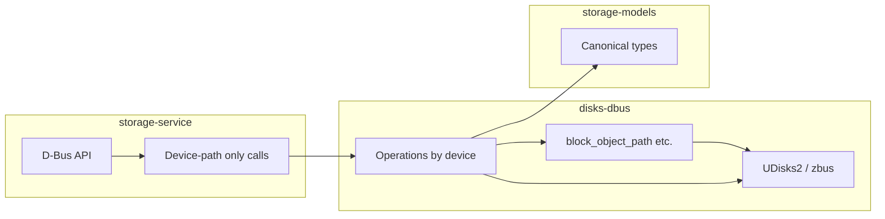

# disks-dbus Investigation: Cleanup and storage-models Alignment

## 1. Unused methods and dead code

**Dead file: [disks-dbus/src/image/loop.rs**](disks-dbus/src/image/loop.rs)  

- The `image` module only declares `pub mod loop_setup` and `pub mod backup` in [disks-dbus/src/image/mod.rs](disks-dbus/src/image/mod.rs). `**loop.rs` is never included** and is dead code.
- It duplicates `loop_setup` (twice in the same file at ~97 and ~207), `open_for_backup`, `open_for_restore`, and adds `mount_filesystem(OwnedObjectPath)`. The live implementations are in `loop_setup.rs` and `backup.rs`.
- **Action:** Remove `image/loop.rs`.

**Dead module: [disks-dbus/src/disks/**](disks-dbus/src/disks/)  

- `disks/mod.rs` is **never declared** in [disks-dbus/src/lib.rs](disks-dbus/src/lib.rs) (no `pub mod disks`). The crate uses `disk` (singular), `filesystem`, `encryption`, `error` for those types.
- The `disks/` directory contains duplicate definitions of `MountOptionsSettings`, `EncryptionOptionsSettings`, and `DiskError` that are never used.
- **Action:** Remove the entire `disks/` directory (or fold any unique volume re-exports into a single place if needed; [disks-dbus/src/volume/mod.rs](disks-dbus/src/volume/mod.rs) is a stub).

**Path-based APIs that only exist for internal use**  

- Public APIs that take `OwnedObjectPath`: `eject_drive`, `power_off_drive`, `standby_drive`, `wakeup_drive`, `remove_drive`, `get_drive_smart_info`, `start_drive_smart_selftest`, `abort_drive_smart_selftest`, `open_for_backup`, `open_for_restore`.
- storage-service uses only the `*_by_device` variants and never the path-based ones. disks-ui does not depend on `disks_dbus` (it uses storage-service and storage_models).
- **Recommendation:** Keep path-based variants for internal use or future callers; no need to remove. Prefer documenting that service code should use `*_by_device` and device-path-only APIs.

---

## 2. Duplication

**MountOptionsSettings**  

- Defined in:
  - [disks-dbus/src/filesystem/config.rs](disks-dbus/src/filesystem/config.rs) (no serde)
  - [storage-models/src/filesystem.rs](storage-models/src/filesystem.rs) (with Serialize/Deserialize, same fields)
- lib.rs re-exports from `filesystem::MountOptionsSettings`.
- **Action:** Use `storage_models::MountOptionsSettings` in disks-dbus. Change `filesystem/config.rs` to use (and re-export) the storage-models type; update `get_mount_options` to return `Option<storage_models::MountOptionsSettings>`. Remove the duplicate struct from disks-dbus.

**EncryptionOptionsSettings**  

- Defined in:
  - [disks-dbus/src/encryption/config.rs](disks-dbus/src/encryption/config.rs)
  - [storage-models/src/encryption.rs](storage-models/src/encryption.rs) (includes `passphrase: Option<String>`)
- **Action:** Use `storage_models::EncryptionOptionsSettings` in disks-dbus. Have encryption/config use and re-export the storage-models type; remove the duplicate struct.

**make_partition_flags_bits**  

- Defined in:
  - [disks-dbus/src/partition/info.rs](disks-dbus/src/partition/info.rs) (uses `udisks2::partition::PartitionFlags`)
  - [storage-models/src/partition.rs](storage-models/src/partition.rs) (same logic, constants match udisks2)
- disks-ui already uses `storage_models::make_partition_flags_bits`.
- **Action:** Remove from disks-dbus and re-export from storage-models in disks-dbus lib.rs (or stop re-exporting if no disks-dbus caller needs it).

**call_udisks_raw / device_for_display**  

- Duplicated across [disks-dbus/src/image/loop_setup.rs](disks-dbus/src/image/loop_setup.rs), [disks-dbus/src/image/backup.rs](disks-dbus/src/image/backup.rs), and the dead [disks-dbus/src/image/loop.rs](disks-dbus/src/image/loop.rs).
- **Action:** After deleting `loop.rs`, extract a shared helper (e.g. in `image/mod.rs` or a small `image/udisks_call.rs`) used by `loop_setup.rs` and `backup.rs` to reduce duplication and overcomplexity.

---

## 3. Overcomplexity

**Service forced to handle D-Bus types**  

- storage-service today:
  - Calls `block_object_path_for_device(&device)` then `open_for_backup(block_path)` / `open_for_restore(block_path)` — so it holds `OwnedObjectPath`.
  - Calls `loop_setup(&image_path)` then parses the object path string to get the loop device name to return to the client.
- **Action:** Add device-based APIs so the service never touches `OwnedObjectPath`:
  - `open_for_backup_by_device(device: &str) -> Result<OwnedFd>` and `open_for_restore_by_device(device: &str) -> Result<OwnedFd>` that resolve internally and call the existing block-path implementation.
  - Add `loop_setup_device_path(image_path: &str) -> Result<String>` (or change `loop_setup` to return device path) so the service gets e.g. `/dev/loop0` and never touches `OwnedObjectPath`.

**Crypttab/fstab logic in storage-service**  

- [storage-service/src/luks.rs](storage-service/src/luks.rs) implements `set_encryption_options` and `default_encryption_options` using:
  - `block_object_path_for_device`, `BlockProxy`, `UDisks2BlockConfigurationProxy`, `ConfigurationItem`, `bytestring_owned_value`, `owned_value_to_bytestring`, and options helpers.
- That puts D-Bus/zvariant types and UDisks2 proxy usage inside the service.
- **Action:** Move crypttab update/clear logic into disks-dbus as:
  - `set_encryption_options(device: &str, settings: &storage_models::EncryptionOptionsSettings) -> Result<()>`
  - `clear_encryption_options(device: &str) -> Result<()>` (or reuse `reset_encryption_options` with a clear implementation).
- Implement these in [disks-dbus/src/encryption/config.rs](disks-dbus/src/encryption/config.rs) (replace the current stub/todo). Then storage-service only parses JSON into `EncryptionOptionsSettings`, calls these two functions, and no longer uses `ConfigurationItem`, `OwnedValue`, or `UDisks2BlockConfigurationProxy`. Stop exporting `ConfigurationItem` and `UDisks2BlockConfigurationProxy` from disks-dbus if no other public consumer needs them (storage-service would no longer need them).

---

## 4. Models that should live in storage-models

**Already in storage-models (use them, remove duplicates)**  

- `MountOptionsSettings` — use from [storage-models/src/filesystem.rs](storage-models/src/filesystem.rs).
- `EncryptionOptionsSettings` — use from [storage-models/src/encryption.rs](storage-models/src/encryption.rs).
- `Usage` — already re-exported from storage-models in [disks-dbus/src/usage.rs](disks-dbus/src/usage.rs); keep.
- `make_partition_flags_bits` — use from storage-models; remove duplicate from disks-dbus.

**Move to storage-models (in this cleanup)**  

- **SmartInfo / SmartSelfTestKind** — Move to storage-models in this cleanup (e.g. `storage_models::smart`); “device” disks-dbus smart module then returns `storage_models::SmartInfo`.
- **(disks-dbus btrfs: see deprecation note below.)**
- “subvolume” models.
- **disks-dbus BTRFS: remove now.** disks-btrfs replaced it. Delete the btrfs module and its exports; callers use disks-btrfs.
- **LogicalVolumeInfo** — Already in [storage-models/src/lvm.rs](storage-models/src/lvm.rs). disks-dbus `list_lvs_for_pv` returns it; no change needed.
- **DiskError** — Stays in disks-dbus as the library’s error type. Optionally add a small set of “domain” error variants in storage-models if the service needs to expose a stable, serializable error code set; not required for this cleanup.

---

## 5. Summary diagram

**Target:** storage-service talks only in device paths and storage-models types; disks-dbus owns all UDisks2/zbus/object-path handling and returns or accepts storage-models types where applicable.

---

## 6. Suggested implementation order

1. **Remove dead code:** Delete `image/loop.rs` and the entire `disks/` directory (and fix any stray references).
2. **Deduplicate types:** Switch MountOptionsSettings and EncryptionOptionsSettings to storage-models in disks-dbus; remove make_partition_flags_bits from disks-dbus and re-export from storage-models if still needed.
3. **Extract shared image helper:** Add a common `call_udisks_raw` (and optionally `device_for_display`) for image/loop_setup and image/backup.
4. **Device-only APIs for service:** Add `open_for_backup_by_device(device)`, `open_for_restore_by_device(device)`, and `loop_setup_device_path(image_path) -> Result<String>` (or equivalent) so the service never touches `OwnedObjectPath`.
5. **Move crypttab into disks-dbus:** Implement and expose `set_encryption_options(device, settings)` and `clear_encryption_options(device)` in disks-dbus; refactor storage-service luks to use them and drop direct use of ConfigurationItem/UDisks2BlockConfigurationProxy/bytestring.
6. **Remove disks-dbus btrfs:** Delete the btrfs module and its exports; callers use disks-btrfs.
7. **Move SmartInfo/SmartSelfTestKind to storage-models:** Add `storage_models::smart` (or similar), then have disks-dbus smart module use and return those types.

